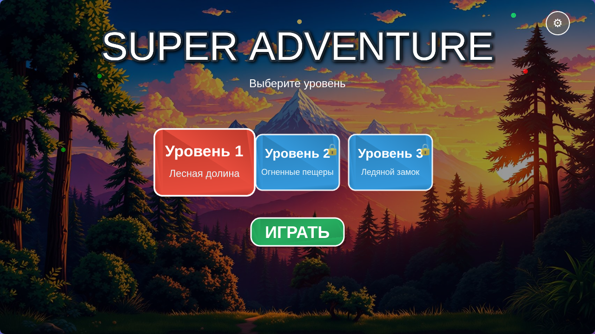
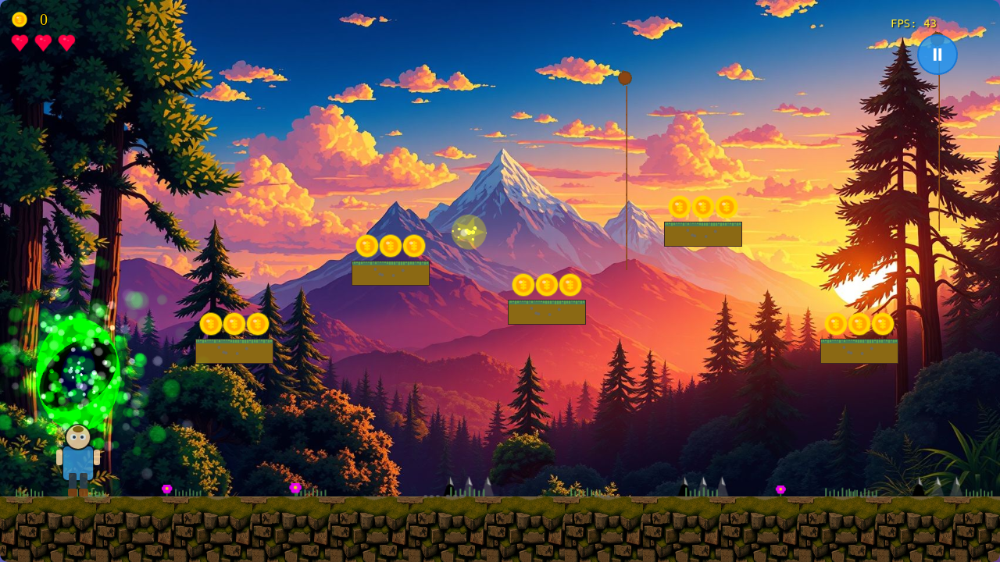

# 🎮 Super Adventure Game

[](https://github.com/yourusername/super-adventure-game)
[](https://github.com/yourusername/super-adventure-game/releases)
[](LICENSE)
[](https://www.typescriptlang.org/)
[](https://phaser.io/)

Профессиональная браузерная платформенная игра, разработанная с использованием современных технологий и лучших практик.

## 🌟 Особенности

- 🎮 **Адаптивный геймплей** - играйте на ПК, планшете или телефоне
- 🏃‍♂️ **Динамичная физика** - реалистичные прыжки, движение и взаимодействия
- 🌿 **Система лиан** - уникальная механика раскачивания
- ⚡ **Power-ups** - тройной прыжок, супер-скорость, неуязвимость
- 🎨 **Красивая графика** - параллакс-фоны, анимации, эффекты
- 📱 **PWA поддержка** - устанавливается как приложение
- 🎯 **Система достижений** - разблокируйте награды
- 💾 **Сохранение прогресса** - продолжайте с места остановки

## 📸 Скриншоты

### Главное меню


### Игровой процесс


## 🚀 Быстрый старт

### Требования
- Node.js 18+
- npm или yarn

### Установка

```bash
# Клонируйте репозиторий
git clone https://github.com/yourusername/super-adventure-game.git

# Перейдите в папку проекта
cd super-adventure-game

# Установите зависимости
npm install

# Запустите в режиме разработки
npm run dev
```

Откройте браузер: http://localhost:3000

## 📱 Мобильная версия

Игра полностью адаптирована для мобильных устройств:
- Автоматическое определение устройства
- Сенсорное управление
- Оптимизация производительности
- Поддержка landscape/portrait режимов

## 🎮 Управление

### ПК
- **A/D** или **←/→** - движение
- **W** или **↑** - прыжок / лазание по лиане
- **S** или **↓** - присесть / спуск по лиане
- **Пробел** - прыжок / отпустить лиану
- **Shift** - бег
- **F** - атака
- **E** - взаимодействие

### Мобильные устройства
- **Джойстик** - движение
- **Кнопка A** - прыжок
- **Кнопка B** - атака
- **Свайп вверх/вниз** - лазание по лиане

## 🏗️ Архитектура

```
src/
├── scenes/          # Игровые сцены
│   ├── PreloadScene.ts
│   ├── MenuScene.ts
│   ├── GameScene.ts
│   └── UIScene.ts
├── entities/        # Игровые сущности
│   ├── Player.ts
│   ├── Enemy.ts
│   └── PowerUp.ts
├── systems/         # Игровые системы
│   ├── PhysicsSystem.ts
│   ├── VineSystem.ts
│   └── SaveSystem.ts
├── ui/             # Интерфейс
│   ├── HUD.ts
│   ├── TouchControls.ts
│   └── PowerUpTimer.ts
└── config/         # Конфигурация
    └── GameConfig.ts
```

## 🛠️ Разработка

### Скрипты

```bash
npm run dev      # Запуск в режиме разработки
npm run build    # Сборка для продакшена
npm run preview  # Предпросмотр сборки
npm run test     # Запуск тестов
npm run lint     # Проверка кода
npm run format   # Форматирование кода
```

### Структура коммитов

Используем [Conventional Commits](https://www.conventionalcommits.org/):
- `feat:` новая функциональность
- `fix:` исправление багов
- `docs:` изменения в документации
- `style:` форматирование кода
- `refactor:` рефакторинг
- `perf:` улучшение производительности
- `test:` добавление тестов
- `chore:` обновление зависимостей

## 📊 Производительность

- ⚡ 60 FPS на современных устройствах
- 📱 30 FPS на слабых мобильных
- 💾 < 10 MB размер сборки
- 🚀 < 3 сек загрузка на 3G

## 🤝 Вклад в проект

См. [CONTRIBUTING.md](CONTRIBUTING.md) для деталей.

## 📝 Лицензия

MIT License - см. [LICENSE](LICENSE) для деталей.

## 👥 Команда

- **John Laptev** - Lead Developer
- **Claude AI** - Technical Assistant

## 📱 Контакты разработчика

<div align="center">

[](https://github.com/John-LapTev)
[](https://t.me/john_laptev)
[](https://instagram.com/john_laptev)

### 🎮 Telegram группа для геймеров и разработчиков
[](https://t.me/JL_Stable_Diffusion)

</div>

## 🙏 Благодарности

- [Phaser 3](https://phaser.io/) - игровой движок
- [TypeScript](https://www.typescriptlang.org/) - типизация
- [Vite](https://vitejs.dev/) - сборщик

---

<p align="center">
  Сделано с ❤️ для геймеров<br>
  <strong>© 2025 John Laptev</strong>
</p>